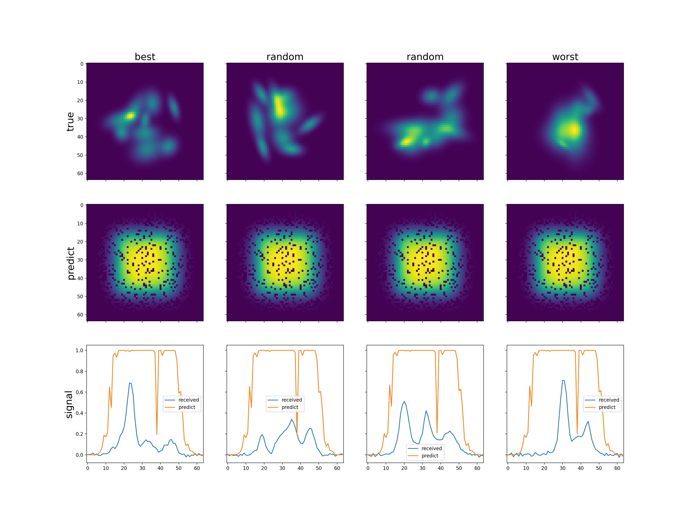

# Report about training model **TorchSensorNN5S_norm_deep**
## Architecture summary
```

TorchSensorNN5S_norm_deep(
  (conv1): Sequential(
    (0): Conv2d(1, 8, kernel_size=(3, 1), stride=(1, 1), padding=same)
    (1): ReLU()
  )
  (block1): Sequential(
    (0): MaxPool2d(kernel_size=(2, 1), stride=(2, 1), padding=0, dilation=1, ceil_mode=False)
    (1): InstanceNorm2d(8, eps=1e-05, momentum=0.1, affine=True, track_running_stats=True)
    (2): Conv2d(8, 64, kernel_size=(3, 1), stride=(1, 1), padding=same)
    (3): ReLU()
    (4): MaxPool2d(kernel_size=(2, 1), stride=(2, 1), padding=0, dilation=1, ceil_mode=False)
    (5): InstanceNorm2d(64, eps=1e-05, momentum=0.1, affine=True, track_running_stats=True)
  )
  (pool1): MaxPool2d(kernel_size=(4, 1), stride=(4, 1), padding=0, dilation=1, ceil_mode=False)
  (block2): Sequential(
    (0): Conv2d(72, 128, kernel_size=(3, 1), stride=(1, 1), padding=same)
    (1): ReLU()
    (2): MaxPool2d(kernel_size=(2, 1), stride=(2, 1), padding=0, dilation=1, ceil_mode=False)
    (3): InstanceNorm2d(128, eps=1e-05, momentum=0.1, affine=True, track_running_stats=True)
    (4): Conv2d(128, 128, kernel_size=(3, 1), stride=(1, 1), padding=same)
    (5): MaxPool2d(kernel_size=(2, 1), stride=(2, 1), padding=0, dilation=1, ceil_mode=False)
  )
  (conv2): Sequential(
    (0): Conv2d(200, 64, kernel_size=(1, 4), stride=(1, 1))
    (1): ReLU()
  )
  (linear): Sequential(
    (0): Linear(in_features=256, out_features=195, bias=True)
    (1): ReLU()
    (2): Linear(in_features=195, out_features=900, bias=True)
    (3): ReLU()
    (4): Linear(in_features=900, out_features=4096, bias=True)
    (5): ReLU()
  )
)

```

## Examples of predictions

