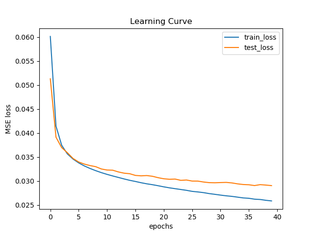
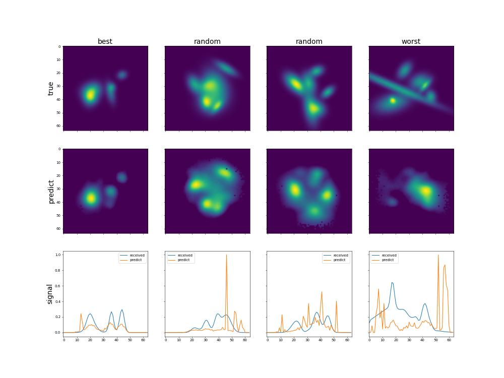

# Report about training model **UpSampleNet**
## Architecture summary
```

============================================================================================================================================
Layer (type:depth-idx)                   Input Shape               Output Shape              Param #                   Kernel Shape
============================================================================================================================================
UpSampleNet                              [100, 4, 64]              [100, 64, 64]             --                        --
├─Sequential: 1-1                        [100, 1, 64, 4]           [100, 8, 64, 4]           --                        --
│    └─Conv2d: 2-1                       [100, 1, 64, 4]           [100, 8, 64, 4]           32                        [3, 1]
│    └─ReLU: 2-2                         [100, 8, 64, 4]           [100, 8, 64, 4]           --                        --
├─Sequential: 1-2                        [100, 8, 64, 4]           [100, 64, 16, 4]          --                        --
│    └─AvgPool2d: 2-3                    [100, 8, 64, 4]           [100, 8, 32, 4]           --                        [2, 1]
│    └─InstanceNorm2d: 2-4               [100, 8, 32, 4]           [100, 8, 32, 4]           16                        --
│    └─Conv2d: 2-5                       [100, 8, 32, 4]           [100, 64, 32, 4]          1,600                     [3, 1]
│    └─ReLU: 2-6                         [100, 64, 32, 4]          [100, 64, 32, 4]          --                        --
│    └─AvgPool2d: 2-7                    [100, 64, 32, 4]          [100, 64, 16, 4]          --                        [2, 1]
│    └─InstanceNorm2d: 2-8               [100, 64, 16, 4]          [100, 64, 16, 4]          128                       --
├─AvgPool2d: 1-3                         [100, 8, 64, 4]           [100, 8, 16, 4]           --                        [4, 1]
├─Sequential: 1-4                        [100, 64, 16, 4]          [100, 128, 4, 4]          --                        --
│    └─Conv2d: 2-9                       [100, 64, 16, 4]          [100, 128, 16, 4]         24,704                    [3, 1]
│    └─ReLU: 2-10                        [100, 128, 16, 4]         [100, 128, 16, 4]         --                        --
│    └─AvgPool2d: 2-11                   [100, 128, 16, 4]         [100, 128, 8, 4]          --                        [2, 1]
│    └─InstanceNorm2d: 2-12              [100, 128, 8, 4]          [100, 128, 8, 4]          256                       --
│    └─Conv2d: 2-13                      [100, 128, 8, 4]          [100, 128, 8, 4]          49,280                    [3, 1]
│    └─AvgPool2d: 2-14                   [100, 128, 8, 4]          [100, 128, 4, 4]          --                        [2, 1]
├─AvgPool2d: 1-5                         [100, 64, 16, 4]          [100, 64, 4, 4]           --                        [4, 1]
├─Sequential: 1-6                        [100, 128, 4, 4]          [100, 64, 4, 1]           --                        --
│    └─Conv2d: 2-15                      [100, 128, 4, 4]          [100, 64, 4, 1]           32,832                    [1, 4]
│    └─ReLU: 2-16                        [100, 64, 4, 1]           [100, 64, 4, 1]           --                        --
├─Sequential: 1-7                        [100, 256]                [100, 400]                --                        --
│    └─Linear: 2-17                      [100, 256]                [100, 400]                102,800                   --
│    └─ReLU: 2-18                        [100, 400]                [100, 400]                --                        --
│    └─Linear: 2-19                      [100, 400]                [100, 400]                160,400                   --
│    └─ReLU: 2-20                        [100, 400]                [100, 400]                --                        --
│    └─Linear: 2-21                      [100, 400]                [100, 400]                160,400                   --
│    └─LeakyReLU: 2-22                   [100, 400]                [100, 400]                --                        --
├─Upsample: 1-8                          [100, 1, 20, 20]          [100, 1, 64, 64]          --                        --
============================================================================================================================================
Total params: 532,448
Trainable params: 532,448
Non-trainable params: 0
Total mult-adds (M): 392.63
============================================================================================================================================
Input size (MB): 0.10
Forward/backward pass size (MB): 26.56
Params size (MB): 2.13
Estimated Total Size (MB): 28.79
============================================================================================================================================

```

## Examples of predictions

