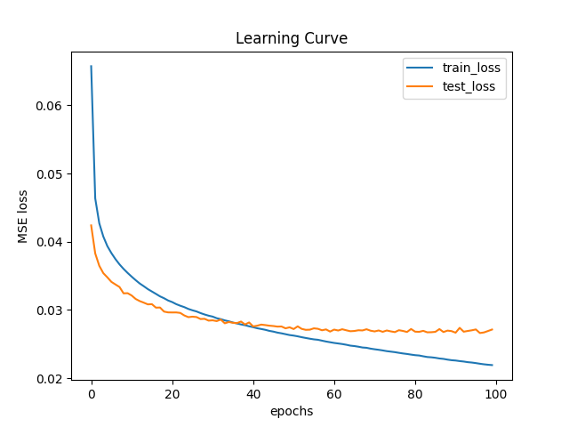

# Report about training model **TorchSensorNN**
## Architecture summary
```

============================================================================================================================================
Layer (type:depth-idx)                   Input Shape               Output Shape              Param #                   Kernel Shape
============================================================================================================================================
TorchSensorNN                            [1000, 4, 64]             [1000, 64, 64]            --                        --
├─Sequential: 1-1                        [1000, 4, 64]             [1000, 64, 64]            --                        --
│    └─Flatten: 2-1                      [1000, 4, 64]             [1000, 256]               --                        --
│    └─Linear: 2-2                       [1000, 256]               [1000, 600]               154,200                   --
│    └─ReLU: 2-3                         [1000, 600]               [1000, 600]               --                        --
│    └─Linear: 2-4                       [1000, 600]               [1000, 600]               360,600                   --
│    └─ReLU: 2-5                         [1000, 600]               [1000, 600]               --                        --
│    └─Linear: 2-6                       [1000, 600]               [1000, 600]               360,600                   --
│    └─ReLU: 2-7                         [1000, 600]               [1000, 600]               --                        --
│    └─Linear: 2-8                       [1000, 600]               [1000, 4096]              2,461,696                 --
│    └─ReLU: 2-9                         [1000, 4096]              [1000, 4096]              --                        --
│    └─Unflatten: 2-10                   [1000, 4096]              [1000, 64, 64]            --                        --
============================================================================================================================================
Total params: 3,337,096
Trainable params: 3,337,096
Non-trainable params: 0
Total mult-adds (G): 3.34
============================================================================================================================================
Input size (MB): 1.02
Forward/backward pass size (MB): 47.17
Params size (MB): 13.35
Estimated Total Size (MB): 61.54
============================================================================================================================================

```

## Examples of predictions

