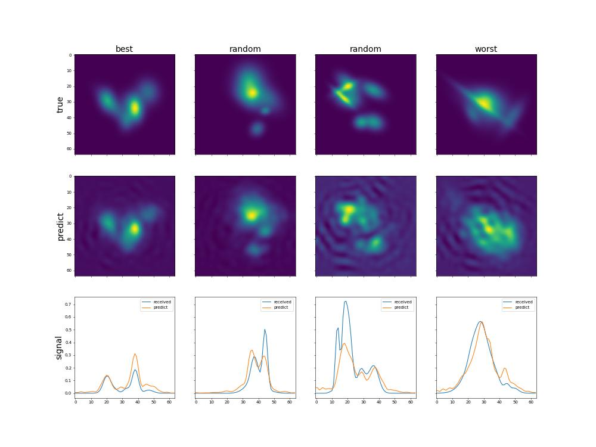

# Report about training model **TorchSensorNN**
## Architecture summary
```

============================================================================================================================================
Layer (type:depth-idx)                   Input Shape               Output Shape              Param #                   Kernel Shape
============================================================================================================================================
TorchSensorNN                            [100, 32, 8]              [100, 64, 64]             --                        --
├─Sequential: 1-1                        [100, 32, 8]              [100, 64, 64]             --                        --
│    └─Flatten: 2-1                      [100, 32, 8]              [100, 256]                --                        --
│    └─Linear: 2-2                       [100, 256]                [100, 600]                154,200                   --
│    └─ReLU: 2-3                         [100, 600]                [100, 600]                --                        --
│    └─Linear: 2-4                       [100, 600]                [100, 600]                360,600                   --
│    └─ReLU: 2-5                         [100, 600]                [100, 600]                --                        --
│    └─Linear: 2-6                       [100, 600]                [100, 600]                360,600                   --
│    └─ReLU: 2-7                         [100, 600]                [100, 600]                --                        --
│    └─Linear: 2-8                       [100, 600]                [100, 4096]               2,461,696                 --
│    └─ReLU: 2-9                         [100, 4096]               [100, 4096]               --                        --
│    └─Unflatten: 2-10                   [100, 4096]               [100, 64, 64]             --                        --
============================================================================================================================================
Total params: 3,337,096
Trainable params: 3,337,096
Non-trainable params: 0
Total mult-adds (M): 333.71
============================================================================================================================================
Input size (MB): 0.10
Forward/backward pass size (MB): 4.72
Params size (MB): 13.35
Estimated Total Size (MB): 18.17
============================================================================================================================================

```

## Examples of predictions

